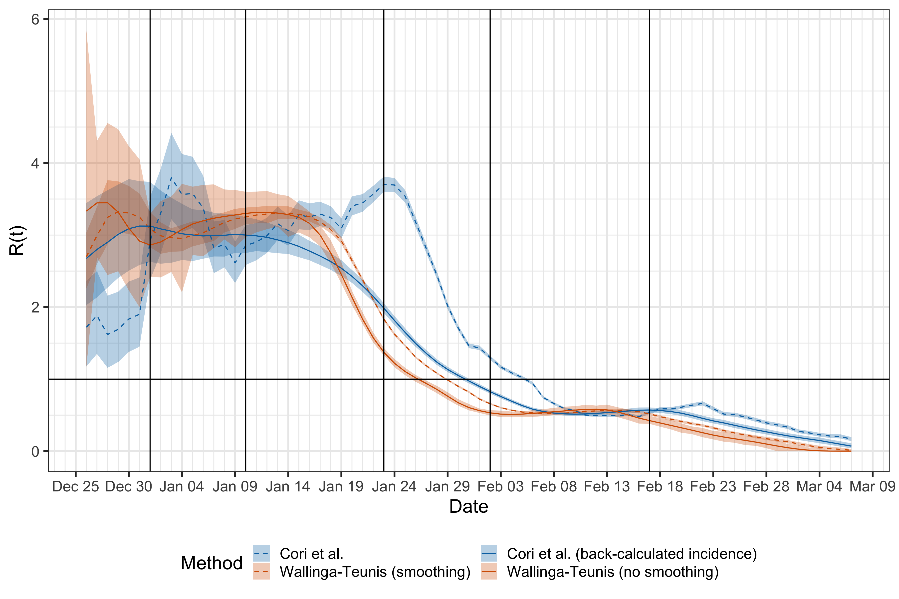

# Using symptom onsets instead of incidences results in time-lagged estimate of R(t).

We reanalyzed the epidemic curve in Pan et al. *JAMA*. 2020 (doi:10.1001/jama.2020.6130) using four methods to estimate the effective reproduction number:

1. The method proposed by Cori et al., applied to the curve of symptom onsets with a 5-day sliding-window smoothing (replicating Figure 4 in [Pan et al.](https://jamanetwork.com/journals/jama/fullarticle/2764658)).
2. The method proposed by Wallinga and Teunis as implemented in the [EpiEstim](https://cran.r-project.org/web/packages/EpiEstim/EpiEstim.pdf) package with a 5-day sliding-window smoothing (replicating the commentary by [Lipsitch et al.](https://github.com/keyajoshi/Pan_response)).
3. The method proposed by Cori et al., applied to a **back-calculated incidence curve** using an incubation period with median = 4.5 days and 95% quantile = 13.4 days.
4. The method proposed by Wallinga and Teunis with **no smoothing** (the original proposal of Wallinga and Teunis).

In short, we find that using symptom onsets instead of incidences results in time-lagged estimate of the instantaneous reproduction number R(t). More details can be found in [this document](jama_comment.pdf).
